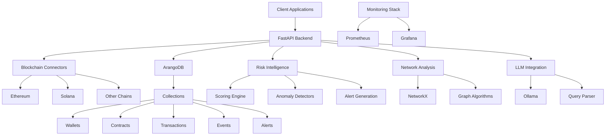
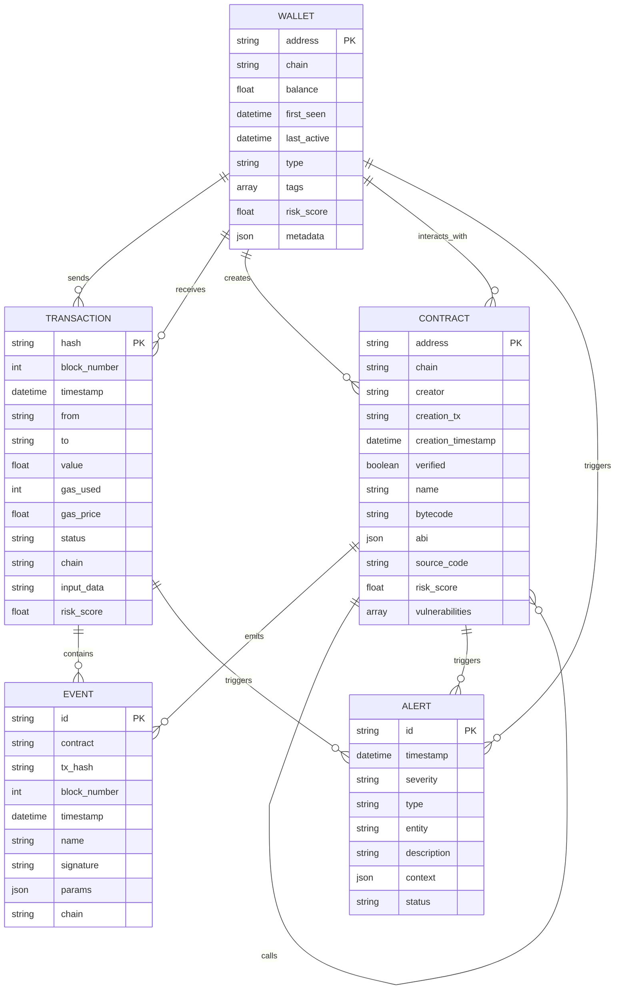
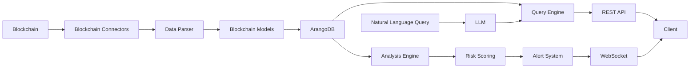

# NeuroSpark Memory Bank

## Project Overview
NeuroSpark is an AI-Powered Blockchain Intelligence System for analyzing smart contracts, monitoring blockchain activities, and providing real-time Web3 security insights. The system is transitioning from version 0.9.0 to 1.0.0, migrating from an agent-based system to a blockchain-first approach.

## System Architecture

## Database Schema

## Data Flow

## Migration Status

The project is currently migrating from an agent-based system to a blockchain-focused architecture:

-  Updated models.py with blockchain terminology
-  Renamed key classes (NetworkAgents � BlockchainNetwork, InteractionData � TransactionData)
-  Updated database operations to reflect blockchain focus
-  Changed WebSocket handler to use blockchain addresses
-  Updated database name from "agent_interactions" to "blockchain_intelligence"
-  Updated test suite with blockchain terminology and fixtures
-  Updated SWAGGER_DOCUMENTATION.md with blockchain API details
-  Updated CHANGELOG.md for version 0.9.1

Pending tasks:
-  Update routes.py and other API endpoint handlers to use the new models
-  Implement changes in data_generator.py
-  Add blockchain connector tests
-  Update API_ENDPOINTS.md to remove agent references
-  Add integration tests for complete blockchain data flow

## Key Components

### Blockchain Connectors
- Ethereum (web3.py)
- Solana (solana.py)
- Extensible architecture for additional chains

### Database (ArangoDB)
- Graph database for storing blockchain entities and relationships
- Collections: Wallets, Contracts, Transactions, Events, Alerts
- Graph relationships for tracing transaction flows

### Risk Intelligence
- Multi-factor scoring system
- Anomaly detection
- Alert generation and management

### LLM Integration
- Ollama for local LLM deployment
- Natural language query processing
- Blockchain data interpretation

### Monitoring
- Prometheus metrics
- Grafana dashboards
- Logging and alerting

## API Structure
- `/blockchain/wallets/*` - Wallet management and analysis
- `/blockchain/transactions/*` - Transaction queries and analysis
- `/blockchain/contracts/*` - Smart contract analysis and risk assessment
- `/blockchain/events/*` - Event filtering and decoding
- `/blockchain/risk/*` - Risk assessment and alerts
- `/blockchain/query/*` - Natural language and pattern queries
- `/analysis/*` - Network analysis endpoints
- `/graph/*` - Graph visualization data