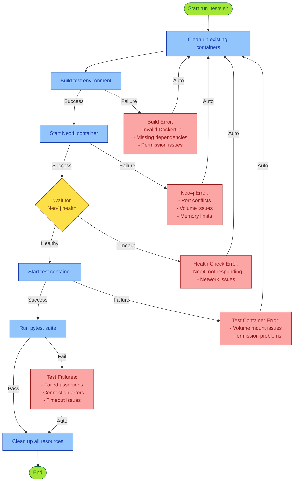
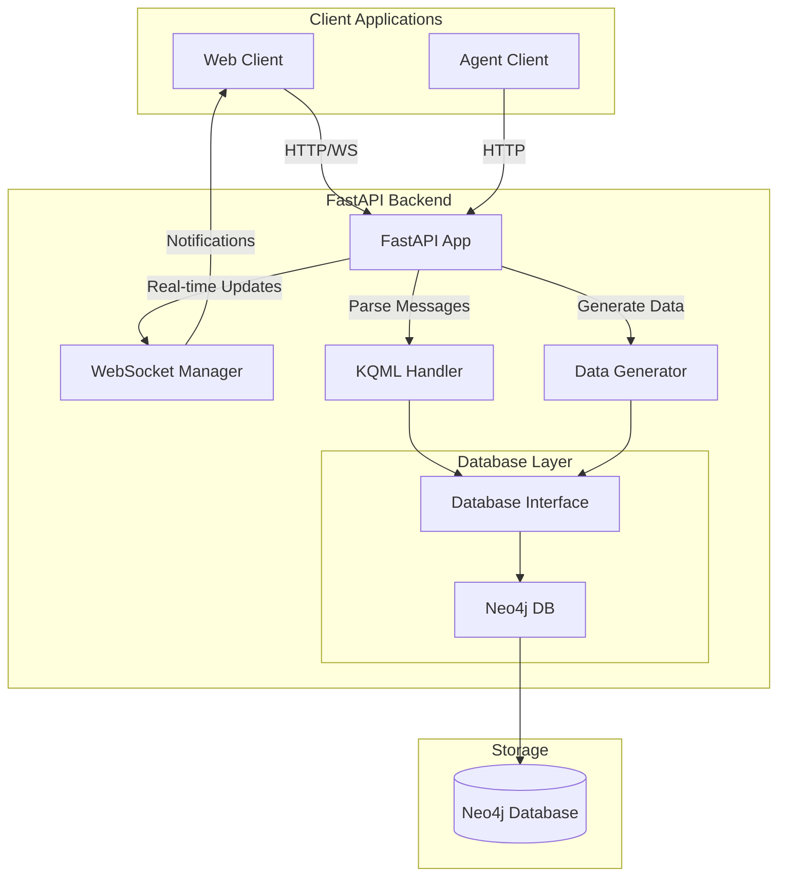
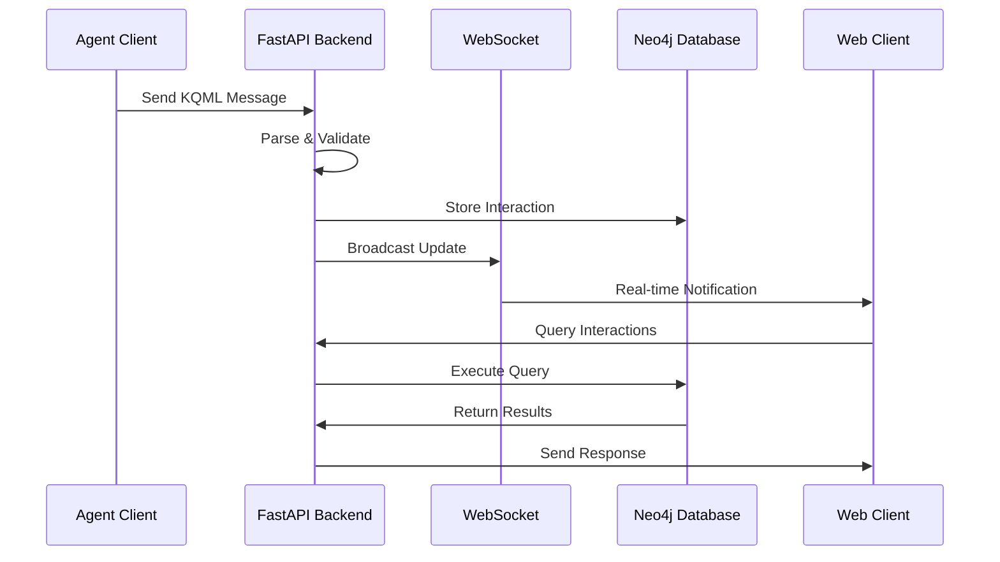
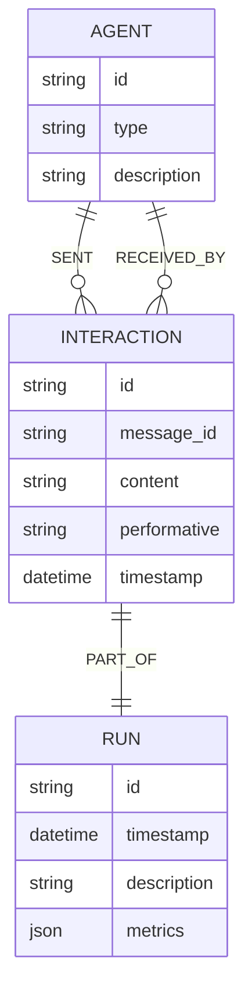
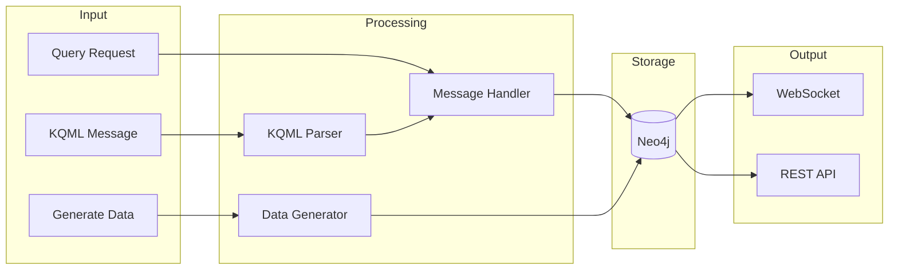

# KQML Parser Backend 0.2.3

A Multi-Agent Graph Intelligence System for processing and storing KQML messages and agent interactions.

## Features

- FastAPI-based REST API with WebSocket support for real-time updates
- Neo4j graph database for persistent storage of agent interactions
- KQML message parsing and validation
- Synthetic data generation for testing and demonstration
- Interactive API documentation with Swagger UI
- Real-time agent interaction monitoring via WebSocket
- Comprehensive test suite with Neo4j integration testing
- Extensive logging and monitoring capabilities

## Prerequisites

- Python 3.11+
- Neo4j 5.x
- Docker and Docker Compose

## Installation

1. Clone the repository:
```bash
git clone https://github.com/JtPerez-Acle/kqml-parser-backend
cd kqml-parser-backend
```

2. Create and activate a virtual environment:
```bash
python -m venv venv
source venv/bin/activate  # On Windows: venv\Scripts\activate
```

3. Install dependencies:
```bash
pip install -e ".[test]"
```

4. Start Neo4j and the application:
```bash
docker-compose up -d
```

This will start both Neo4j and the FastAPI application in containers.

## Environment Variables

The application uses the following environment variables for Neo4j configuration:
- `NEO4J_URI`: Neo4j connection URI (default: `bolt://localhost:7687`)
- `NEO4J_USER`: Neo4j username (default: `neo4j`)
- `NEO4J_PASSWORD`: Neo4j password (default: `kqml_dev_2025`)

These variables are automatically set in the `docker-compose.yml` file. For local development without Docker:
```bash
export NEO4J_URI=bolt://localhost:7687
export NEO4J_USER=neo4j
export NEO4J_PASSWORD=kqml_dev_2025
```

## Running Tests

The test suite uses a containerized Neo4j instance for all database operations. This ensures that tests run in an environment that matches production.

### Using run_tests.sh (Recommended)

We provide a convenient script that handles the entire test setup and execution:

```bash
./run_tests.sh
```

This script will:
1. Clean up any existing test containers and volumes
2. Build a fresh test environment using Docker Compose
3. Start a Neo4j container configured specifically for testing
4. Run the test suite with coverage reporting
5. Clean up all test containers and volumes after completion

The script uses `docker-compose.test.yml` which:
- Runs Neo4j in a temporary filesystem (tmpfs) for fast testing
- Ensures proper isolation between test runs
- Matches the production environment configuration
- Provides health checks to ensure Neo4j is ready before tests start

### Manual Testing

If you need more control over the test environment, you can run the components manually:

1. Start the test Neo4j container:
```bash
docker-compose -f docker-compose.test.yml up -d neo4j
```

2. Run the tests:
```bash
pytest -v --cov=app --cov-report=term-missing
```

This will:
- Run all tests against the Neo4j database
- Generate a coverage report
- Validate all database operations
- Test error handling and edge cases
- Verify logging and monitoring

### Test Flow Visualization



The diagram shows:
- 🟦 Blue boxes: Main process steps
- 🟨 Yellow diamonds: Decision points
- 🟩 Green boxes: Start/End points
- 🟥 Red boxes: Potential failure points and their causes

Key features of our test orchestration:
1. **Automatic Cleanup**: Every failure triggers automatic cleanup to prevent resource leaks
2. **Health Checks**: Neo4j container must be healthy before tests begin
3. **Failure Isolation**: Each component (build, Neo4j, tests) fails independently
4. **Resource Management**: All resources are cleaned up, regardless of success or failure

## Running the Application

Start the FastAPI server:
```bash
uvicorn app.main:app --reload
```

The API will be available at:
- API: http://localhost:8000
- Interactive Documentation (Swagger UI): http://localhost:8000/docs
- Alternative Documentation (ReDoc): http://localhost:8000/redoc
- WebSocket: ws://localhost:8000/ws

## API Endpoints

### Root Endpoint
- `GET /` - Get API information

### Agent Interactions
- `POST /agents/message` - Process a KQML message
- `GET /agents/{agent_id}/runs` - Get all runs for a specific agent
- `GET /agents/{agent_id}/interactions` - Get all interactions for a specific agent

### Network Operations
- `POST /network/query` - Process natural language queries about agent interactions
- `POST /synthetic/data` - Generate synthetic interaction data
- `GET /synthetic/kqml` - Generate a synthetic KQML message

### WebSocket
- `WebSocket /ws` - Real-time agent interaction updates

## System Architecture



## Data Flow



## Database Schema



## Component Interaction



## Contributing

1. Fork the repository
2. Create a feature branch
3. Make your changes
4. Run tests to ensure they pass
5. Submit a pull request

## License

MIT License. See LICENSE file for details.