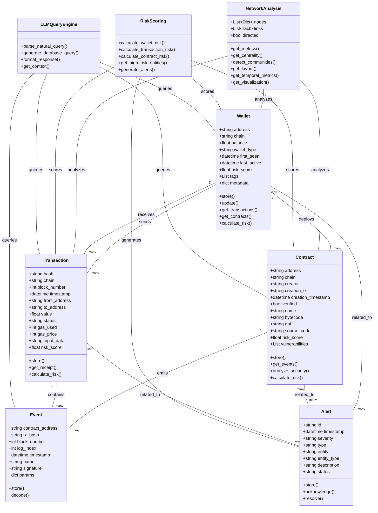
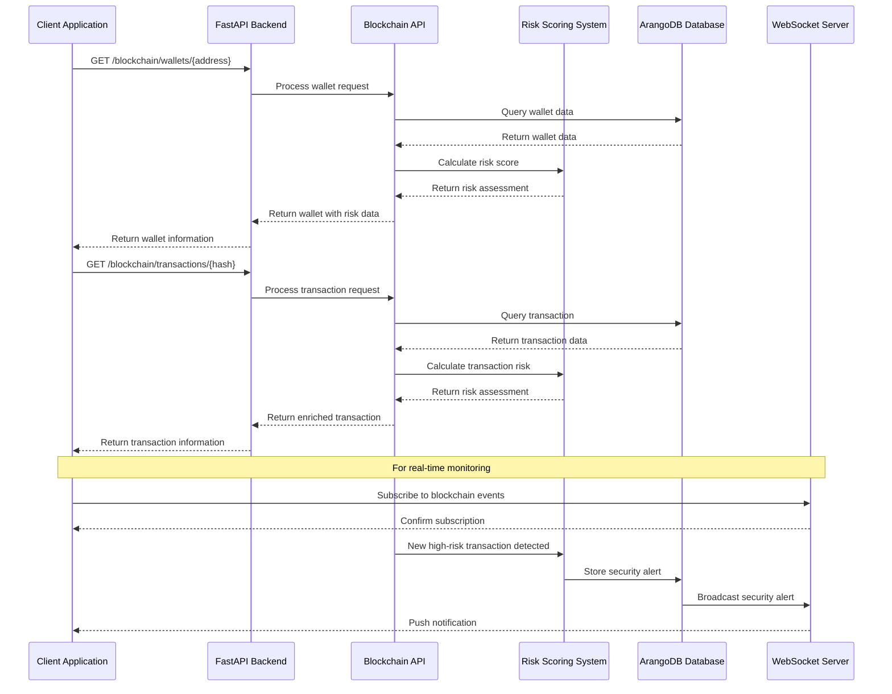
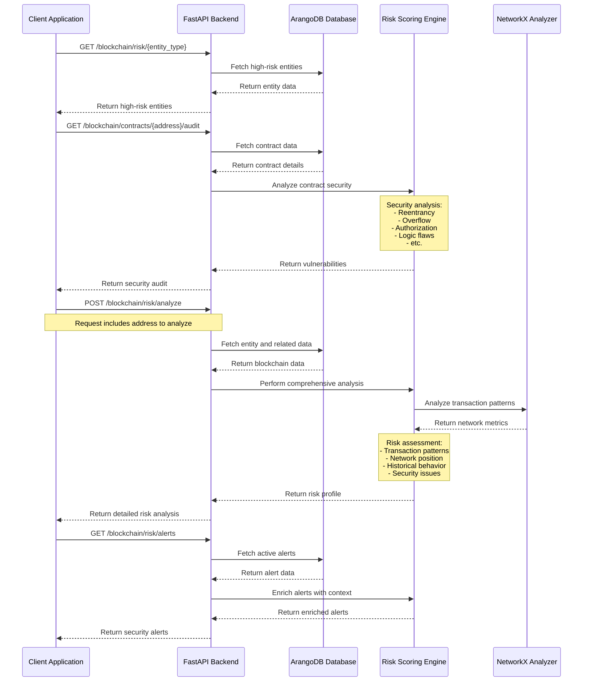
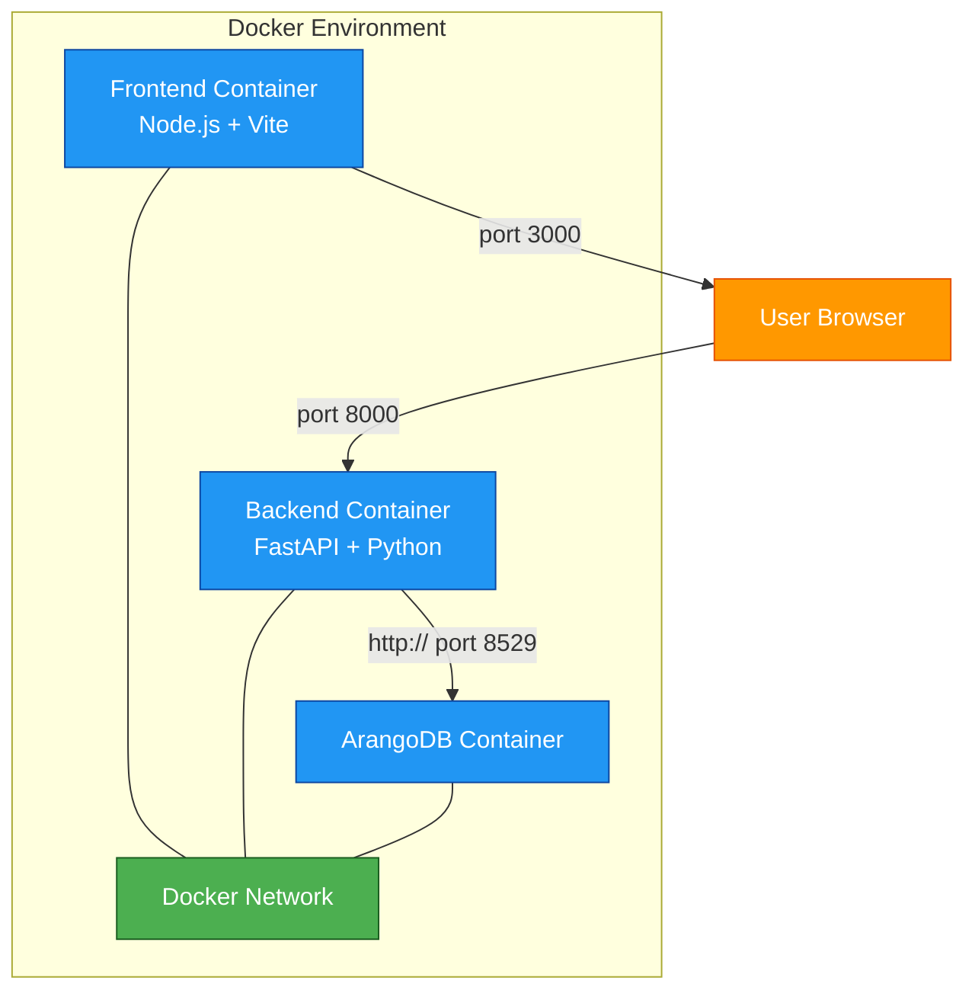
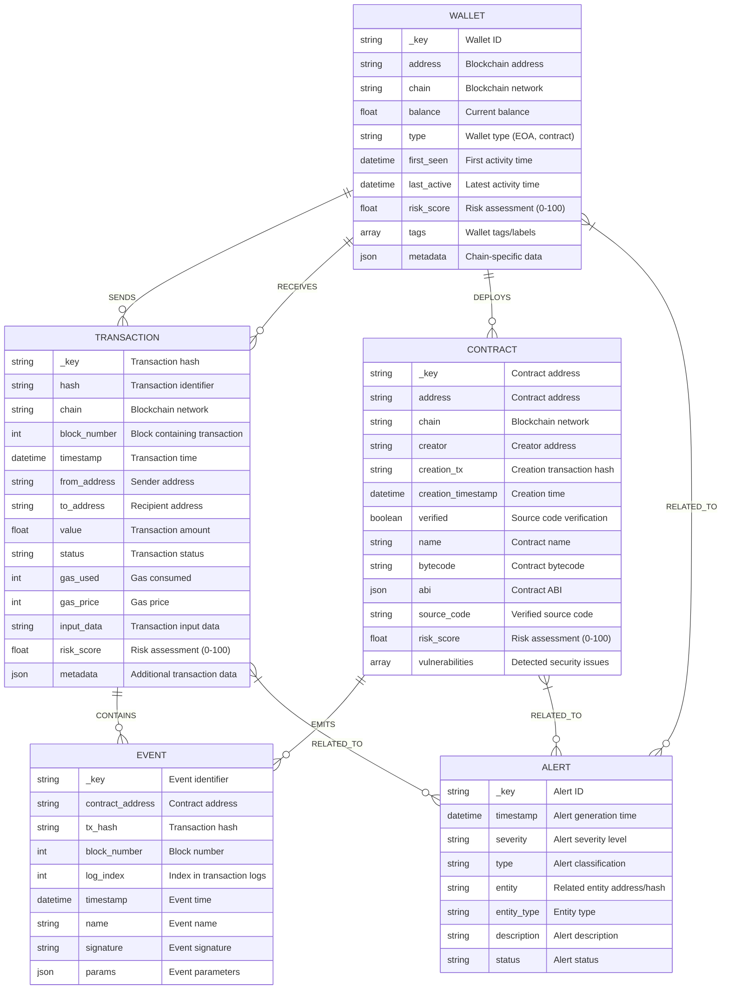
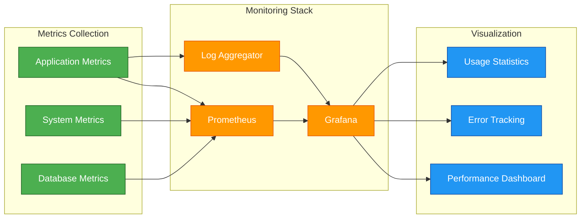

# NeuroSpark v0.9.2

An AI-Powered Blockchain Intelligence System for analyzing smart contracts, monitoring blockchain activities, and providing real-time Web3 security insights with advanced graph analytics.

## 🌟 Introducing NeuroSpark 0.9.2: Comprehensive Blockchain Intelligence

The latest version completely transforms the platform into a powerful blockchain intelligence system:

- **Multi-Chain Web3 Data Integration**: Seamlessly ingest and model data from Ethereum and other blockchain networks with our high-performance connectors
- **Complete Blockchain Entity Modeling**: Comprehensive tracking and analysis of wallets, transactions, smart contracts, and events in a unified data model
- **Advanced Risk Intelligence**: Sophisticated multi-factor risk scoring for all blockchain entities using behavioral pattern analysis
- **Smart Contract Security Analysis**: Robust vulnerability detection and risk assessment for smart contract code with detailed reports
- **Real-time Blockchain Monitoring**: Instant detection and alerting for suspicious blockchain activities through our WebSocket-based alert system
- **LLM-Powered Natural Language Queries**: Intuitive natural language interface for complex blockchain data analysis powered by Ollama integration
- **Blockchain-Specific Graph Analytics**: Specialized algorithms designed specifically for blockchain transaction flow analysis and network visualization

## Core Features

- **Blockchain Integration & Analysis**:
  - **Multi-chain Support**: Connectors for Ethereum (primary) with extensible architecture for Solana and other chains
  - **Comprehensive Entity Models**: Complete data models for wallets, transactions, contracts, and events with rich metadata
  - **Graph-based Blockchain Analysis**: Advanced relationship modeling to uncover connections between blockchain entities
  - **Risk Intelligence Engine**: Sophisticated multi-factor risk scoring system with behavioral pattern analysis
  - **Real-time Monitoring System**: WebSocket-based alerting for immediate notification of suspicious blockchain activities
  - **Smart Contract Security**: Vulnerability detection and risk assessment for deployed smart contracts

- **Advanced Graph Analytics for Blockchain**:
  - **Transaction Flow Analysis**: Follow the money through complex transaction paths with NetworkX integration
  - **Entity Importance Measurement**: Multiple centrality algorithms to identify key wallets and contracts in the network
  - **Relationship Cluster Detection**: Advanced community detection to discover related entity groups
  - **Temporal Blockchain Analysis**: Track changes in network structure and entity behavior over time periods
  - **Anomaly Detection**: Identify unusual patterns and outliers in transaction networks
  - **Specialized Visualization**: Optimized layouts for complex blockchain relationship visualization

- **LLM-Powered Natural Language Interface**:
  - **Intuitive Query System**: Query complex blockchain data using simple natural language instructions
  - **Ollama Integration**: Efficient local LLM deployment with optimized performance
  - **Blockchain-Specific Prompt Engineering**: Custom templates designed for different types of blockchain analysis
  - **Context-Aware Response Generation**: Rich, informative responses with relevant blockchain context
  - **Query Translation**: Automatic conversion of natural language to optimized database queries
  - **Explainable Results**: Clear explanations of blockchain terminology and significance of findings

- **Synthetic Blockchain Data Generation**:
  - **Realistic Blockchain Patterns**: Generate statistically accurate transaction patterns based on real-world data
  - **DeFi Scenario Simulation**: Model specialized scenarios including DEX trades, lending protocols, and NFT markets
  - **Security Testing Environment**: Create test datasets with known vulnerabilities for security research
  - **Behavioral Pattern Modeling**: Simulate both normal and suspicious transaction patterns for risk testing
  - **Configurable Parameters**: Extensive customization options for all aspects of synthetic data generation

- **Enterprise-grade Infrastructure**:
  - **High-performance Backend**: FastAPI with async/await pattern for optimal throughput and responsiveness
  - **Real-time Event System**: WebSocket support for instant blockchain event notifications
  - **Optimized Graph Database**: ArangoDB with specialized indexes for efficient blockchain data querying
  - **Comprehensive Test Coverage**: Extensive test suite with 80+ tests and continuous integration
  - **Observability Stack**: Complete monitoring with Prometheus/Grafana dashboards
  - **Docker-based Deployment**: Simple deployment with containerized components including LLM integration

## System Architecture

```mermaid
graph TD
    subgraph "Application Components"
        FE[Frontend UI<br>React + TypeScript]
        BE[Backend API<br>FastAPI + Python]
        WS[WebSocket Server]
        DG[Data Generator]
        
        subgraph "Blockchain Components"
            BC[Blockchain Connectors]
            RI[Risk Intelligence]
            SC[Smart Contract Analysis]
            BA[Blockchain API]
        end
        
        subgraph "Analysis Components" 
            NX[NetworkX Integration]
            GM[Graph Metrics]
            CD[Community Detection]
            CN[Centrality Analysis]
            TF[Transaction Flow Analysis]
            AR[Anomaly Recognition]
        end
        
        subgraph "LLM Components"
            LM[LLM Integration]
            QP[Query Parser]
            PT[Prompt Templates]
        end
    end
    
    subgraph "Database"
        DB[(ArangoDB Graph Database)]
        subgraph "Entity Collections"
            WC[Wallets]
            TC[Transactions]
            CC[Contracts]
            EC[Events]
            AC[Alerts]
        end
    end
    
    subgraph "External Services"
        ETH[Ethereum API]
        SOL[Solana API]
        OL[Ollama LLM]
    end
    
    subgraph "Monitoring"
        PR[Prometheus]
        GR[Grafana Dashboards]
        LOG[Logging System]
    end
    
    US[Users] -->|Interact with| FE
    FE -->|Send Requests| BE
    BE -->|Real-time Updates| WS
    WS -->|Notifications| FE
    BE -->|Store/Query| DB
    BE -->|Generate Test Data| DG
    DG -->|Populate| DB
    
    %% Blockchain Integration
    BC -->|Ethereum Data| ETH
    BC -->|Solana Data| SOL
    BC -->|Process| BA
    BA -->|Store| DB
    BA -->|Analyze Risk| RI
    RI -->|Generate| AC
    SC -->|Analyze| CC
    
    %% NetworkX Integration
    BE <-->|Analyze| NX
    NX -->|Calculate| GM
    NX -->|Detect| CD
    NX -->|Measure| CN
    NX -->|Track| TF
    NX -->|Detect| AR
    
    %% LLM Integration
    BE <-->|Natural Language Query| LM
    LM -->|Query| OL
    LM -->|Parse| QP
    LM -->|Template| PT
    QP -->|Database Query| DB
    
    %% Monitoring
    BE -->|Metrics| PR
    PR -->|Visualize| GR
    BE -->|Log Events| LOG
    
    classDef frontend fill:#42a5f5,stroke:#1565c0,color:#fff
    classDef backend fill:#66bb6a,stroke:#2e7d32,color:#fff
    classDef database fill:#ff7043,stroke:#e64a19,color:#fff
    classDef monitoring fill:#ab47bc,stroke:#7b1fa2,color:#fff
    classDef analysis fill:#26c6da,stroke:#00838f,color:#fff
    classDef blockchain fill:#fdd835,stroke:#f57f17,color:#000
    classDef llm fill:#ec407a,stroke:#ad1457,color:#fff
    classDef external fill:#78909c,stroke:#37474f,color:#fff
    classDef user fill:#8d6e63,stroke:#4e342e,color:#fff
    
    class FE frontend
    class BE,WS,DG backend
    class DB,WC,TC,CC,EC,AC database
    class PR,GR,LOG monitoring
    class NX,GM,CD,CN,TF,AR analysis
    class BC,RI,SC,BA blockchain
    class LM,QP,PT llm
    class ETH,SOL,OL external
    class US user
```



## Domain Model



## Data Flow and Analytics Processes

### Blockchain Transaction Flow



### Risk Analysis Flow



## API Endpoints

### Blockchain Data Endpoints

- `GET /blockchain/wallets/{address}` - Get detailed wallet information including balance, transaction history, and risk assessment
- `GET /blockchain/wallets/{address}/transactions` - Get all transactions involving a specific wallet with pagination and filtering
- `GET /blockchain/wallets/{address}/contracts` - Get all contracts deployed by or interacted with by a specific wallet
- `GET /blockchain/transactions/{tx_hash}` - Get comprehensive transaction details including receipt and event logs
- `GET /blockchain/contracts/{address}` - Get contract information with metadata and security assessment
- `GET /blockchain/contracts/{address}/events` - Get all events emitted by a specific contract with filtering options
- `GET /blockchain/contracts/{address}/audit` - Get detailed security audit report for a smart contract
- `POST /blockchain/wallets/batch` - Retrieve detailed information for multiple wallets in a single request
- `POST /blockchain/transactions/batch` - Retrieve detailed information for multiple transactions in a single request

### Risk Intelligence Endpoints

- `GET /blockchain/risk/{entity_type}` - Get high-risk entities by type (wallets, transactions, contracts) with customizable risk thresholds
- `GET /blockchain/risk/alerts` - Get active security alerts with severity classification and context
- `POST /blockchain/risk/analyze` - Perform comprehensive risk analysis on any blockchain entity with detailed reports
- `GET /blockchain/risk/suspicious` - Get suspicious activities detected in recent blockchain transactions
- `GET /blockchain/risk/overview` - Get aggregated risk metrics across the monitored blockchain ecosystem

### Network Graph Endpoints

- `GET /blockchain/network` - Get blockchain network visualization data with configurable depth and entity types
- `POST /blockchain/network/query` - Query blockchain network with complex filters and relationship criteria
- `GET /blockchain/network/clusters` - Get pre-identified relationship clusters among blockchain entities

### Natural Language Query Endpoints

- `POST /blockchain/query/natural` - Execute LLM-powered natural language blockchain queries with context awareness
- `POST /blockchain/query/trace` - Trace transaction paths between blockchain entities with customizable depth
- `POST /blockchain/query/pattern` - Identify specific transaction patterns among blockchain entities

### Analytics Endpoints

- `GET /analysis/metrics` - Get comprehensive blockchain network metrics with statistical analysis
- `GET /analysis/centrality` - Calculate key influential entities in the blockchain network using multiple centrality algorithms
- `GET /analysis/communities` - Detect and analyze relationship clusters within the blockchain network
- `GET /analysis/flow` - Analyze value flow and circulation patterns through the network
- `GET /analysis/temporal` - Analyze blockchain network metrics across different time periods
- `GET /analysis/visualization` - Get enhanced network visualization with integrated metrics and highlights

### Data Generation Endpoints

- `POST /generate/data` - Generate realistic synthetic blockchain data with configurable parameters
- `POST /generate/scenario` - Generate scenario-based blockchain data for specific use cases (DEX, lending, NFT, etc.)
- `POST /generate/transaction` - Generate a single synthetic blockchain transaction

For detailed information about all available endpoints, request/response formats, and examples, please refer to the [API_ENDPOINTS.md](./API_ENDPOINTS.md) file or visit the interactive API documentation at [`http://localhost:8000/docs`](http://localhost:8000/docs) when the server is running.

## Prerequisites

- Python 3.11+
- ArangoDB 3.11+
- Docker and Docker Compose
- Node.js 18+ (for frontend development)

## Installation

1. Clone the repository:
```bash
git clone https://github.com/JtPerez-Acle/neurospark
cd neurospark
```

2. Choose one of the following startup methods:

### Initial Setup (First-time Users)
```bash
./setup.sh
```
This interactive script guides you through the first-time setup with:
- Customizable ArangoDB password configuration
- Complete services startup with a clean environment
- Database connectivity verification and troubleshooting
- Summary of available commands

### Production Deployment
```bash
./start.sh
```
Starts the full stack with:
- ArangoDB database
- Backend FastAPI service
- Prometheus and Grafana for monitoring
- Perfect for production or demonstration

### Development Environment
```bash
./start_dev.sh
```
Starts a lightweight environment with:
- ArangoDB database
- Backend FastAPI service
- Optimized for development without monitoring overhead

### Shutdown
```bash
./stop.sh
```
Gracefully stops all running services.

### Manual Local Development
```bash
# Start ArangoDB with Docker
docker-compose up -d arangodb

# Backend development setup
python -m venv venv
source venv/bin/activate  # On Windows: venv\Scripts\activate
poetry install

# Run backend server
poetry run uvicorn app.main:app --reload

# Frontend development setup
cd ../kqml-parser-frontend
npm install
npm run dev
```

## Environment Variables

The application uses these environment variables:

### ArangoDB Settings
- `ARANGO_HOST`: ArangoDB host (default: `localhost`)
- `ARANGO_PORT`: ArangoDB port (default: `8529`)
- `ARANGO_DB`: ArangoDB database name (default: `blockchain_intelligence`)
- `ARANGO_USER`: ArangoDB username (default: `root`)
- `ARANGO_PASSWORD`: ArangoDB password (default: `password`)

These are set in the `docker-compose.yml` file. For local development:
```bash
export ARANGO_HOST=localhost
export ARANGO_PORT=8529
export ARANGO_DB=blockchain_intelligence
export ARANGO_USER=root
export ARANGO_PASSWORD=password
```

> **Note About ArangoDB**: 
> ArangoDB is a multi-model database that supports document, graph, and key-value storage, making it perfect for our blockchain intelligence system. The web interface (accessible at http://localhost:8529 after starting the containers) provides intuitive tools for visualizing and managing your data.
>
> Use the provided `setup.sh` script for an automated, guided setup experience.

## Running Tests

### Using run_tests.sh (Recommended)

We provide a script that handles the test setup and execution:

```bash
./run_tests.sh
```

This script will:
1. Clean up any existing test containers and volumes
2. Build a fresh test environment using Docker Compose
3. Start an ArangoDB container for testing
4. Run the test suite with coverage reporting
5. Clean up all test containers and volumes after completion

### Manual Testing

For more control over the test environment:

1. Start the test ArangoDB container:
```bash
docker-compose -f docker-compose.test.yml up -d arangodb
```

2. Run the tests:
```bash
pytest -v --cov=app --cov-report=term-missing
```
- Our test suite currently has over 80% coverage, focusing on all critical files.
- 81/81 tests passing with full blockchain terminology consistency

## Running the Application

### Using Start Scripts (Recommended)

We provide several scripts to manage the application:

1. **Production Mode:**
```bash
./start.sh
```
This script will start the complete stack including:
- ArangoDB database
- Backend API service
- Prometheus for metrics
- Grafana for dashboards
- Log aggregator

2. **Development Mode:**
```bash
./start_dev.sh
```
This starts a minimal environment with:
- ArangoDB database
- Backend API service
Perfect for development when you don't need the full monitoring stack.

3. **Stop Services:**
```bash
./stop.sh
```
This gracefully stops all running services.

### Manual Startup

For local development without Docker:
```bash
# Activate your virtual environment
source venv/bin/activate  # On Windows: venv\Scripts\activate

# Start the FastAPI server
uvicorn app.main:app --reload
```

The API will be available at:
- API: http://localhost:8000
- Interactive Documentation (Swagger UI): http://localhost:8000/docs
- Alternative Documentation (ReDoc): http://localhost:8000/redoc
- WebSocket: ws://localhost:8000/ws

The Frontend will be available at:
- http://localhost:3000 (when running the frontend separately)

## API Endpoints

### Root Endpoint
- `GET /` - Get API information and capabilities

### Blockchain Data Endpoints
- `GET /blockchain/wallets/{address}` - Get detailed wallet information
- `GET /blockchain/wallets/{address}/transactions` - Get wallet transactions
- `GET /blockchain/wallets/{address}/contracts` - Get contracts deployed or interacted with
- `GET /blockchain/wallets/batch` - Retrieve multiple wallets in a single request
- `GET /blockchain/transactions/{hash}` - Get transaction details
- `GET /blockchain/transactions/filter` - Filter transactions by criteria
- `POST /blockchain/transactions/batch` - Retrieve multiple transactions
- `GET /blockchain/contracts/{address}` - Get contract information
- `GET /blockchain/contracts/{address}/events` - Get contract events
- `GET /blockchain/contracts/{address}/audit` - Get contract security audit
- `GET /blockchain/events/filter` - Filter events by criteria
- `POST /blockchain/events/decode` - Decode event data

### Risk Intelligence Endpoints
- `GET /blockchain/risk/{entity_type}` - Get high-risk entities by type
- `GET /blockchain/risk/alerts` - Get active security alerts
- `POST /blockchain/risk/analyze` - Perform comprehensive risk analysis
- `GET /blockchain/risk/suspicious` - Get suspicious activities
- `GET /blockchain/risk/overview` - Get risk metrics and statistics

### Blockchain Network Analysis
- `GET /blockchain/network` - Get blockchain network visualization data
- `POST /blockchain/network/query` - Query blockchain network with filters
- `GET /blockchain/network/clusters` - Get entity relationship clusters

### Natural Language Query Endpoints
- `POST /blockchain/query/natural` - Execute natural language blockchain queries
- `POST /blockchain/query/trace` - Trace transaction paths
- `POST /blockchain/query/pattern` - Identify transaction patterns

### Graph Analytics Endpoints
- `GET /analysis/metrics` - Get blockchain network metrics
- `GET /analysis/centrality` - Calculate key entity influence metrics
- `GET /analysis/communities` - Detect entity communities
- `GET /analysis/flow` - Analyze value flow through the network
- `GET /analysis/temporal` - Track metrics over time
- `GET /analysis/visualization` - Get enhanced visualization data

### Data Generation Endpoints
- `POST /generate/data` - Generate synthetic blockchain data
- `POST /generate/scenario` - Generate blockchain scenario data
- `POST /generate/transaction` - Generate a single synthetic transaction

### Database Administration
- `DELETE /admin/database/clear` - Clear all data from the database
- `POST /admin/database/setup` - Initialize database collections and indexes

### WebSocket Endpoints
- `WebSocket /ws` - Real-time blockchain event notifications

For detailed API documentation with request/response examples, please refer to the [API_ENDPOINTS.md](./API_ENDPOINTS.md) file or visit the Swagger UI at http://localhost:8000/docs when the backend is running.

## Docker Deployment

The full stack can be deployed using Docker Compose:



## Database Schema

### Blockchain Graph Database

The system uses ArangoDB as a specialized graph database for blockchain data, providing excellent performance for complex relationship queries:



## Monitoring Dashboard



## Contributing

1. Fork the repository
2. Create a feature branch
3. Make your changes
4. Run tests to ensure they pass
5. Submit a pull request

## License

MIT License. See LICENSE file for details.
