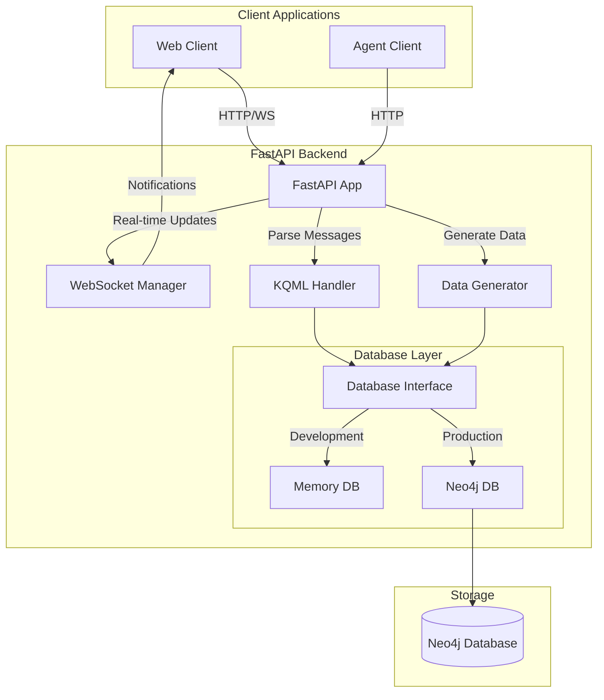
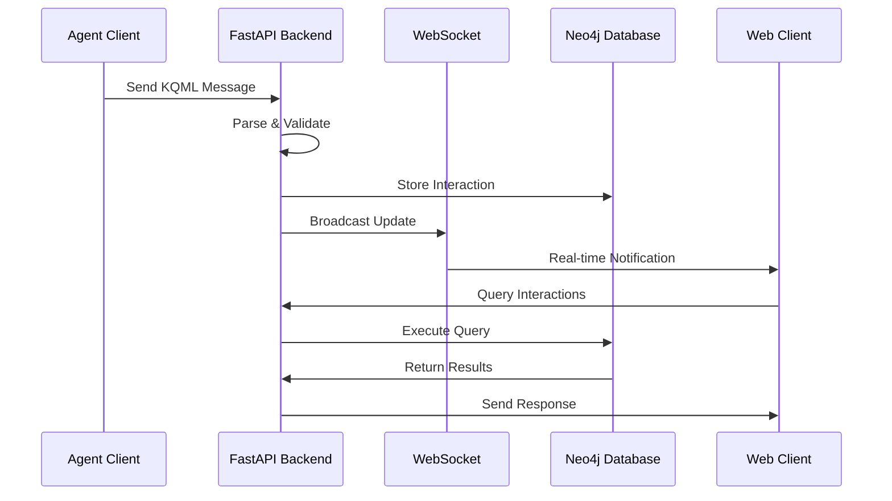
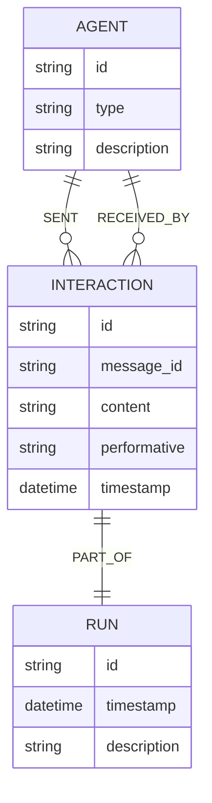
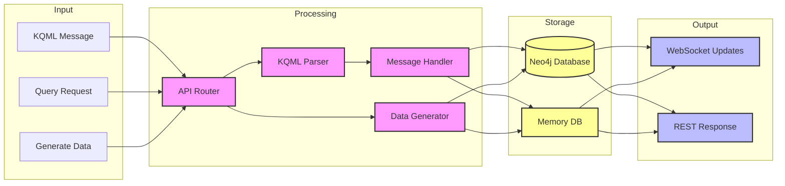

# KQML Parser Backend

A Multi-Agent Graph Intelligence System for processing and storing KQML messages and agent interactions.

## Features

- FastAPI-based REST API with WebSocket support for real-time updates
- Neo4j graph database for persistent storage of agent interactions
- In-memory database option for testing and development
- KQML message parsing and validation
- Synthetic data generation for testing and demonstration
- Interactive API documentation with Swagger UI
- Real-time agent interaction monitoring via WebSocket
- Comprehensive test suite with 100% passing tests and coverage reporting

## Prerequisites

- Python 3.11+
- Neo4j 5.x
- Docker (optional, for running Neo4j)

## Installation

1. Clone the repository:
```bash
git clone https://github.com/JtPerez-Acle/kqml-parser-backend
cd kqml-parser-backend
```

2. Create and activate a virtual environment:
```bash
python -m venv venv
source venv/bin/activate  # On Windows: venv\Scripts\activate
```

3. Install dependencies:
```bash
pip install -e ".[test]"
```

4. Start Neo4j:

Using Docker:
```bash
docker run -d --name neo4j \
  -p 7474:7474 -p 7687:7687 \
  -e NEO4J_AUTH=neo4j/testpassword \
  neo4j:latest
```

Or use your existing Neo4j installation.

## Environment Variables

The application uses the following environment variables for Neo4j configuration:
- `NEO4J_URI`: Neo4j connection URI (default: `bolt://localhost:7687`)
- `NEO4J_USER`: Neo4j username (default: `neo4j`)
- `NEO4J_PASSWORD`: Neo4j password (default: `testpassword`)

## Running the Application

Start the FastAPI server:
```bash
uvicorn app.main:app --reload
```

The API will be available at:
- API: http://localhost:8000
- Interactive Documentation (Swagger UI): http://localhost:8000/docs
- Alternative Documentation (ReDoc): http://localhost:8000/redoc
- WebSocket: ws://localhost:8000/ws

## API Endpoints

### Root Endpoint
- `GET /` - Get API information

### Agent Interactions
- `POST /agents/message` - Process a KQML message
- `GET /agents/{agent_id}/runs` - Get all runs for a specific agent
- `GET /agents/{agent_id}/interactions` - Get all interactions for a specific agent

### Network Operations
- `POST /network/query` - Process natural language queries about agent interactions
- `POST /synthetic/data` - Generate synthetic interaction data
- `GET /synthetic/kqml` - Generate a synthetic KQML message

### WebSocket
- `WebSocket /ws` - Real-time agent interaction updates

## System Architecture



## Data Flow



## Database Schema



## Component Interaction



## Example Usage

### Send a KQML Message

```bash
curl -X POST "http://localhost:8000/agents/message" \
  -H "Content-Type: application/json" \
  -d '{
    "message": "(tell :sender agent1 :receiver agent2 :content (temperature 25.5))",
    "sender": "agent1",
    "receiver": "agent2"
  }'
```

### Query Agent Interactions

```bash
curl -X POST "http://localhost:8000/network/query" \
  -H "Content-Type: application/json" \
  -d '{
    "query": "Find all temperature readings above 25 degrees"
  }'
```

### Generate Synthetic Data

```bash
curl -X POST "http://localhost:8000/synthetic/data?num_runs=2&interactions_per_run=5"
```

### Connect to WebSocket for Real-time Updates

```javascript
const ws = new WebSocket('ws://localhost:8000/ws');
ws.onmessage = function(event) {
    console.log('New interaction:', JSON.parse(event.data));
};
```

## Development

### Running Tests

Run the test suite with Neo4j:
```bash
./run_tests.sh
```

This script will:
1. Set up the required environment variables
2. Run all tests with coverage reporting
3. Generate both HTML and terminal coverage reports

Current test status:
- Total tests: 36
- Passing: 36 (100%)
- Coverage: 61%

### Project Structure

```
kqml-parser-backend/
├── app/
│   ├── __init__.py
│   ├── main.py              # FastAPI application setup
│   ├── routes.py            # API endpoints and routing
│   ├── database/
│   │   ├── __init__.py
│   │   ├── base.py         # Database interface
│   │   ├── memory_db.py    # In-memory implementation
│   │   └── neo4j_db.py     # Neo4j implementation
│   ├── data_generator.py    # Synthetic data generation
│   ├── kqml_handler.py      # KQML message processing
│   ├── models.py           # Pydantic models
│   └── websocket_handler.py # WebSocket management
├── tests/
│   ├── __init__.py
│   ├── test_main.py
│   ├── test_database.py
│   ├── test_data_generator.py
│   ├── test_kqml_handler.py
│   └── test_websocket.py
├── pyproject.toml          # Project configuration
├── setup.py               # Package setup
├── pytest.ini             # Pytest configuration
├── run_tests.sh          # Test runner script
└── README.md
```

## Contributing

1. Fork the repository
2. Create a feature branch
3. Commit your changes
4. Push to the branch
5. Create a Pull Request

## License

[MIT License](LICENSE)