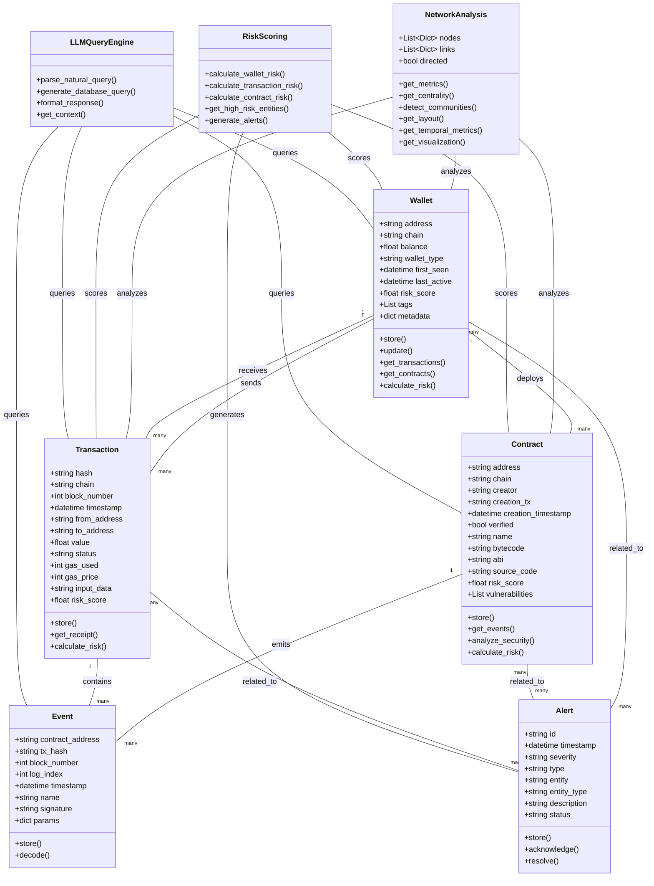
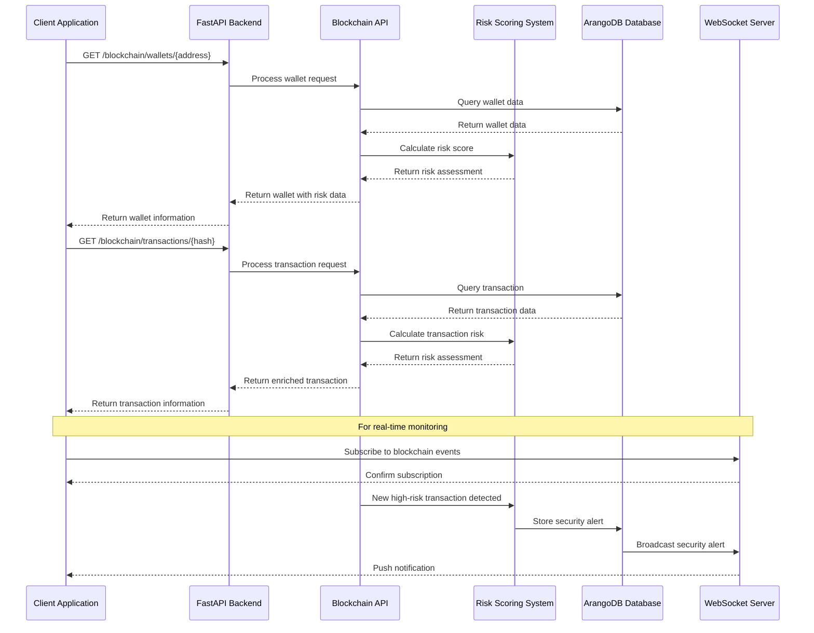
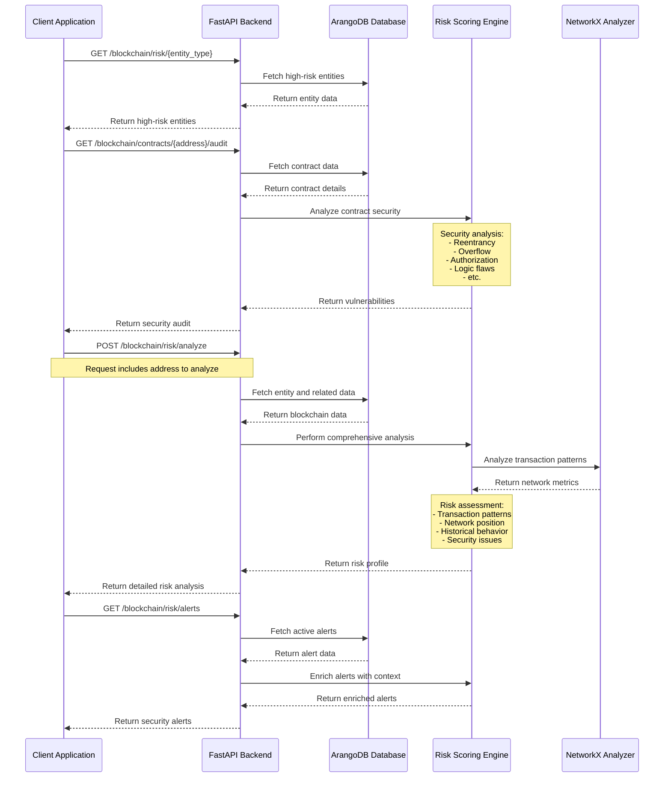
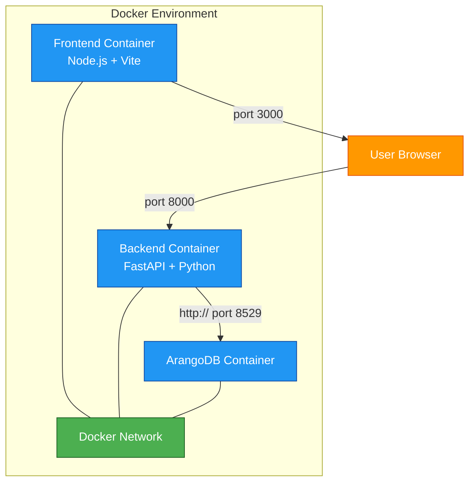
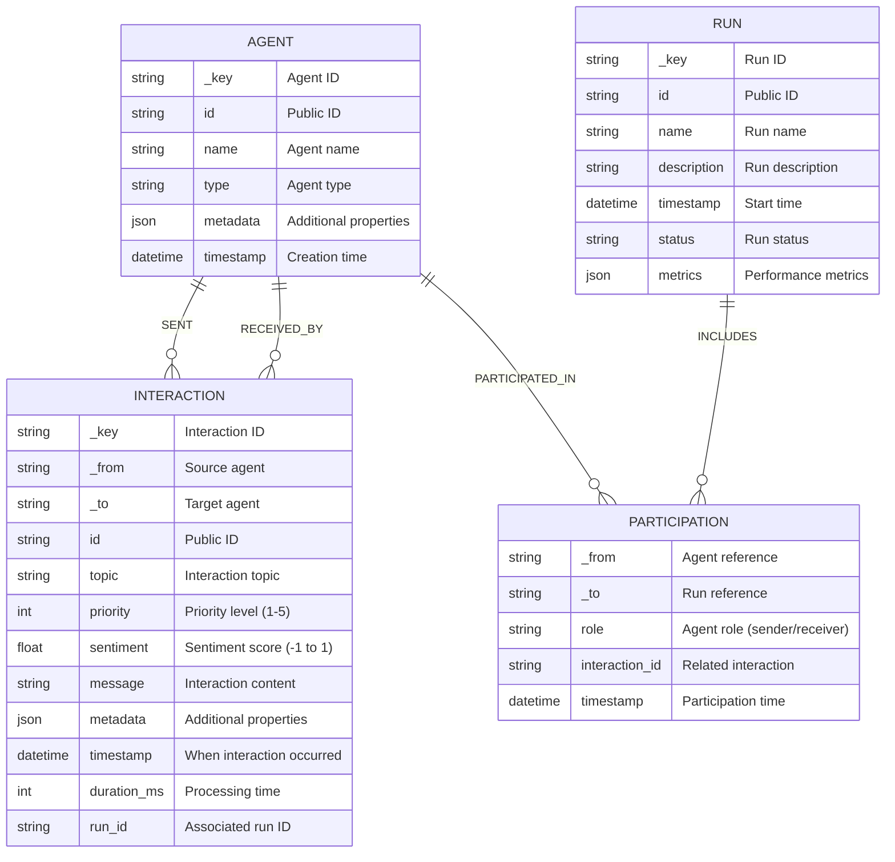
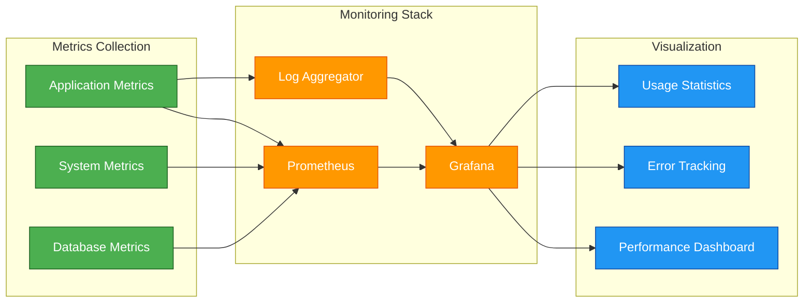

# NeuroSpark v0.9.0 (Unreleased)

An AI-Powered Blockchain Intelligence System for analyzing smart contracts, monitoring blockchain activities, and providing real-time Web3 security insights with advanced graph analytics.

## 🌟 New in v0.9.0: Blockchain Intelligence & Risk Analysis

This release transforms the platform into a comprehensive blockchain intelligence system:

- **Web3 Data Integration**: Ingest and model data from multiple blockchain networks (Ethereum, Solana)
- **Blockchain Entity Models**: Track and analyze wallets, transactions, smart contracts, and events
- **Risk Intelligence System**: Multi-factor risk scoring for all blockchain entities
- **Smart Contract Analysis**: Security vulnerability detection for smart contract code
- **Real-time Monitoring**: Detect and alert on suspicious blockchain activities
- **LLM-Powered Queries**: Natural language interface for blockchain data analysis
- **Enhanced Graph Analytics**: Specialized algorithms for blockchain transaction flow analysis

## Core Features

- **Blockchain Integration & Analysis**:
  - Multi-chain support with connectors for Ethereum and Solana
  - Comprehensive entity models for wallets, transactions, contracts, and events
  - Graph-based approach to blockchain data for relationship analysis
  - Automatic risk scoring based on multiple risk factors
  - Real-time monitoring and alerts for suspicious activities

- **Advanced Graph Analytics**:
  - NetworkX integration for blockchain transaction flow analysis
  - Node centrality metrics to identify key entities in transaction networks
  - Community detection to discover related wallet clusters
  - Temporal analysis to track changes in blockchain behavior over time
  - Visualization layouts optimized for blockchain network display

- **LLM-Powered Natural Language Interface**:
  - Query blockchain data using natural language
  - Integrated with Ollama for local LLM deployment
  - Specialized prompt templates for blockchain-specific queries
  - Context-aware responses with relevant transaction data

- **Synthetic Blockchain Data Generation**:
  - Generate realistic blockchain transaction patterns
  - Simulate various DeFi scenarios (DEX trades, lending, NFT markets)
  - Create test environments with known vulnerabilities for security research
  - Model normal and suspicious transaction patterns for risk testing

- **Robust Infrastructure**:
  - FastAPI backend with async/await pattern for high performance
  - WebSocket support for real-time blockchain event notifications
  - ArangoDB graph database for efficient blockchain data storage
  - Comprehensive test suite with 75+ tests and >50% code coverage
  - Docker-based deployment with monitoring stack (Prometheus/Grafana)

## System Architecture

```mermaid
graph TD
    subgraph "Application Components"
        FE[Frontend UI<br>React + TypeScript]
        BE[Backend API<br>FastAPI + Python]
        WS[WebSocket Server]
        DG[Data Generator]
        
        subgraph "Blockchain Components"
            BC[Blockchain Connectors]
            RI[Risk Intelligence]
            SC[Smart Contract Analysis]
            BA[Blockchain API]
        end
        
        subgraph "Analysis Components" 
            NX[NetworkX Integration]
            GM[Graph Metrics]
            CD[Community Detection]
            CN[Centrality Analysis]
            TF[Transaction Flow Analysis]
            AR[Anomaly Recognition]
        end
        
        subgraph "LLM Components"
            LM[LLM Integration]
            QP[Query Parser]
            PT[Prompt Templates]
        end
    end
    
    subgraph "Database"
        DB[(ArangoDB Graph Database)]
        subgraph "Entity Collections"
            WC[Wallets]
            TC[Transactions]
            CC[Contracts]
            EC[Events]
            AC[Alerts]
        end
    end
    
    subgraph "External Services"
        ETH[Ethereum API]
        SOL[Solana API]
        OL[Ollama LLM]
    end
    
    subgraph "Monitoring"
        PR[Prometheus]
        GR[Grafana Dashboards]
        LOG[Logging System]
    end
    
    US[Users] -->|Interact with| FE
    FE -->|Send Requests| BE
    BE -->|Real-time Updates| WS
    WS -->|Notifications| FE
    BE -->|Store/Query| DB
    BE -->|Generate Test Data| DG
    DG -->|Populate| DB
    
    %% Blockchain Integration
    BC -->|Ethereum Data| ETH
    BC -->|Solana Data| SOL
    BC -->|Process| BA
    BA -->|Store| DB
    BA -->|Analyze Risk| RI
    RI -->|Generate| AC
    SC -->|Analyze| CC
    
    %% NetworkX Integration
    BE <-->|Analyze| NX
    NX -->|Calculate| GM
    NX -->|Detect| CD
    NX -->|Measure| CN
    NX -->|Track| TF
    NX -->|Detect| AR
    
    %% LLM Integration
    BE <-->|Natural Language Query| LM
    LM -->|Query| OL
    LM -->|Parse| QP
    LM -->|Template| PT
    QP -->|Database Query| DB
    
    %% Monitoring
    BE -->|Metrics| PR
    PR -->|Visualize| GR
    BE -->|Log Events| LOG
    
    classDef frontend fill:#42a5f5,stroke:#1565c0,color:#fff
    classDef backend fill:#66bb6a,stroke:#2e7d32,color:#fff
    classDef database fill:#ff7043,stroke:#e64a19,color:#fff
    classDef monitoring fill:#ab47bc,stroke:#7b1fa2,color:#fff
    classDef analysis fill:#26c6da,stroke:#00838f,color:#fff
    classDef blockchain fill:#fdd835,stroke:#f57f17,color:#000
    classDef llm fill:#ec407a,stroke:#ad1457,color:#fff
    classDef external fill:#78909c,stroke:#37474f,color:#fff
    classDef user fill:#8d6e63,stroke:#4e342e,color:#fff
    
    class FE frontend
    class BE,WS,DG backend
    class DB,WC,TC,CC,EC,AC database
    class PR,GR,LOG monitoring
    class NX,GM,CD,CN,TF,AR analysis
    class BC,RI,SC,BA blockchain
    class LM,QP,PT llm
    class ETH,SOL,OL external
    class US user
```



## Domain Model



## Data Flow and Analytics Processes

### Blockchain Transaction Flow



### Risk Analysis Flow



## API Endpoints

### Blockchain Data Endpoints

- `/blockchain/wallets/{address}` - Get wallet information
- `/blockchain/wallets/{address}/transactions` - Get wallet transactions
- `/blockchain/wallets/{address}/contracts` - Get contracts deployed or interacted with
- `/blockchain/transactions/{tx_hash}` - Get transaction details
- `/blockchain/contracts/{address}` - Get contract information
- `/blockchain/contracts/{address}/events` - Get contract events
- `/blockchain/contracts/{address}/audit` - Get contract security audit

### Risk Intelligence Endpoints

- `/blockchain/risk/{entity_type}` - Get high-risk entities (wallets, transactions, contracts)
- `/blockchain/risk/alerts` - Get active security alerts
- `/blockchain/risk/analyze` - Perform comprehensive risk analysis
- `/blockchain/risk/suspicious` - Get suspicious activities

### Network Graph Endpoints

- `/blockchain/network` - Get blockchain network visualization data
- `/blockchain/network/query` - Query blockchain network with complex filters

### Natural Language Query Endpoints

- `/blockchain/query/natural` - LLM-powered natural language blockchain queries
- `/blockchain/query/trace` - Trace transaction paths through entities
- `/blockchain/query/pattern` - Identify transaction patterns

### Analytics Endpoints

- `/analysis/metrics` - Get blockchain network metrics
- `/analysis/centrality` - Calculate key entities in blockchain network
- `/analysis/communities` - Detect related entity clusters
- `/analysis/flow` - Analyze value flow through the network
- `/analysis/visualization` - Get enhanced network visualization

### Data Generation Endpoints

- `/generate/data` - Generate synthetic blockchain data
- `/generate/scenario` - Generate blockchain scenario-based data

For detailed information about all available endpoints, request/response formats, and examples, please refer to the [API_ENDPOINTS.md](./API_ENDPOINTS.md) file or visit the interactive API documentation at [`http://localhost:8000/docs`](http://localhost:8000/docs) when the server is running.

## Prerequisites

- Python 3.11+
- ArangoDB 3.11+
- Docker and Docker Compose
- Node.js 18+ (for frontend development)

## Installation

1. Clone the repository:
```bash
git clone https://github.com/JtPerez-Acle/agent-interaction-backend
cd agent-interaction-backend
```

2. Choose one of the following startup methods:

### Initial Setup (First-time Users)
```bash
./setup.sh
```
This interactive script guides you through the first-time setup with:
- Customizable ArangoDB password configuration
- Complete services startup with a clean environment
- Database connectivity verification and troubleshooting
- Summary of available commands

### Production Deployment
```bash
./start.sh
```
Starts the full stack with:
- ArangoDB database
- Backend FastAPI service
- Prometheus and Grafana for monitoring
- Perfect for production or demonstration

### Development Environment
```bash
./start_dev.sh
```
Starts a lightweight environment with:
- ArangoDB database
- Backend FastAPI service
- Optimized for development without monitoring overhead

### Shutdown
```bash
./stop.sh
```
Gracefully stops all running services.

### Manual Local Development
```bash
# Start ArangoDB with Docker
docker-compose up -d arangodb

# Backend development setup
python -m venv venv
source venv/bin/activate  # On Windows: venv\Scripts\activate
poetry install

# Run backend server
poetry run uvicorn app.main:app --reload

# Frontend development setup
cd ../kqml-parser-frontend
npm install
npm run dev
```

## Environment Variables

The application uses these environment variables:

### ArangoDB Settings
- `ARANGO_HOST`: ArangoDB host (default: `localhost`)
- `ARANGO_PORT`: ArangoDB port (default: `8529`)
- `ARANGO_DB`: ArangoDB database name (default: `agent_interactions`)
- `ARANGO_USER`: ArangoDB username (default: `root`)
- `ARANGO_PASSWORD`: ArangoDB password (default: `password`)

These are set in the `docker-compose.yml` file. For local development:
```bash
export ARANGO_HOST=localhost
export ARANGO_PORT=8529
export ARANGO_DB=agent_interactions
export ARANGO_USER=root
export ARANGO_PASSWORD=password
```

> **Note About ArangoDB**: 
> ArangoDB is a multi-model database that supports document, graph, and key-value storage, making it perfect for our agent interaction system. The web interface (accessible at http://localhost:8529 after starting the containers) provides intuitive tools for visualizing and managing your data.
>
> Use the provided `setup.sh` script for an automated, guided setup experience.

## Running Tests

### Using run_tests.sh (Recommended)

We provide a script that handles the test setup and execution:

```bash
./run_tests.sh
```

This script will:
1. Clean up any existing test containers and volumes
2. Build a fresh test environment using Docker Compose
3. Start an ArangoDB container for testing
4. Run the test suite with coverage reporting
5. Clean up all test containers and volumes after completion

### Manual Testing

For more control over the test environment:

1. Start the test ArangoDB container:
```bash
docker-compose -f docker-compose.test.yml up -d arangodb
```

2. Run the tests:
```bash
pytest -v --cov=app --cov-report=term-missing
```

## Running the Application

### Using Start Scripts (Recommended)

We provide several scripts to manage the application:

1. **Production Mode:**
```bash
./start.sh
```
This script will start the complete stack including:
- ArangoDB database
- Backend API service
- Prometheus for metrics
- Grafana for dashboards
- Log aggregator

2. **Development Mode:**
```bash
./start_dev.sh
```
This starts a minimal environment with:
- ArangoDB database
- Backend API service
Perfect for development when you don't need the full monitoring stack.

3. **Stop Services:**
```bash
./stop.sh
```
This gracefully stops all running services.

### Manual Startup

For local development without Docker:
```bash
# Activate your virtual environment
source venv/bin/activate  # On Windows: venv\Scripts\activate

# Start the FastAPI server
uvicorn app.main:app --reload
```

The API will be available at:
- API: http://localhost:8000
- Interactive Documentation (Swagger UI): http://localhost:8000/docs
- Alternative Documentation (ReDoc): http://localhost:8000/redoc
- WebSocket: ws://localhost:8000/ws

The Frontend will be available at:
- http://localhost:3000 (when running the frontend separately)

## API Endpoints

### Root Endpoint
- `GET /` - Get API information

### Interaction Management
- `POST /interactions` - Create a new interaction
- `GET /interactions` - Get all interactions with optional filtering
- `GET /interactions/{interaction_id}` - Get a specific interaction

### Agent Management
- `POST /agents` - Create a new agent
- `GET /agents` - Get all agents
- `POST /agents/interaction` - Store an agent interaction
- `GET /agents/{agent_id}/interactions` - Get all interactions for a specific agent
- `GET /agents/{agent_id}/runs` - Get all runs for a specific agent
- `GET /agents/stats` - Get agent statistics

### Network Operations
- `GET /network` - Get network graph data with optional filtering
- `POST /network/query` - Query network graph with specific filters

### Graph Visualization
- `GET /graph` - Get nodes and links for graph visualization

### Network Analysis
- `GET /analysis/metrics` - Get comprehensive graph metrics (density, clustering, etc.)
- `GET /analysis/centrality` - Get node centrality measures (degree, betweenness, etc.)
- `GET /analysis/communities` - Detect communities within the network
- `GET /analysis/layout` - Generate layout coordinates for graph visualization
- `GET /analysis/temporal` - Analyze graph metrics over time periods
- `GET /analysis/visualization` - Get comprehensive visualization data with metrics

### Query Operations
- `POST /query` - Execute natural language queries on interactions

### Data Generation
- `POST /generate/data` - Generate synthetic agent and interaction data
- `POST /generate/kqml` - Generate a synthetic KQML interaction
- `GET /generate/interaction` - Generate a single random interaction without storing it

### Database Operations
- `DELETE /admin/database/clear` - Clear all data from the database
- `POST /admin/database/clean` - Clean up orphaned nodes and invalid relationships

### Deprecated Endpoints (for backward compatibility)
- `POST /agents/message` - Store an interaction (use `/agents/interaction` instead)
- `POST /synthetic/data` - Generate synthetic data (use `/generate/data` instead)
- `POST /synthetic/kqml` - Generate synthetic interactions (use `/generate/kqml` instead)

### WebSocket
- `WebSocket /ws` - Real-time interaction updates

For detailed API documentation with request/response examples, please refer to the [API_ENDPOINTS.md](./API_ENDPOINTS.md) file or visit the Swagger UI at http://localhost:8000/docs when the backend is running.

## Docker Deployment

The full stack can be deployed using Docker Compose:



## Database Schema

### ArangoDB Implementation

The system now uses ArangoDB, a multi-model database that provides excellent graph capabilities while being easier to manage than Neo4j:



## Monitoring Dashboard



## Contributing

1. Fork the repository
2. Create a feature branch
3. Make your changes
4. Run tests to ensure they pass
5. Submit a pull request

## License

MIT License. See LICENSE file for details.