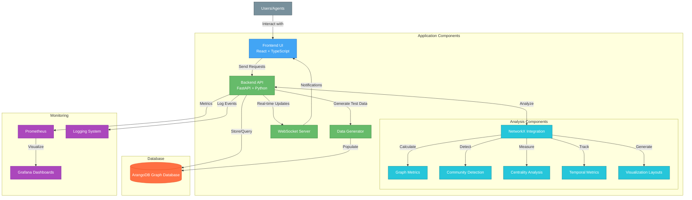
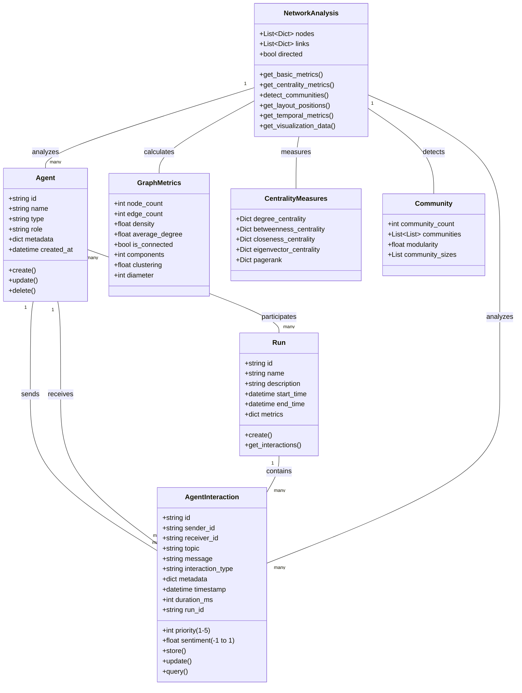
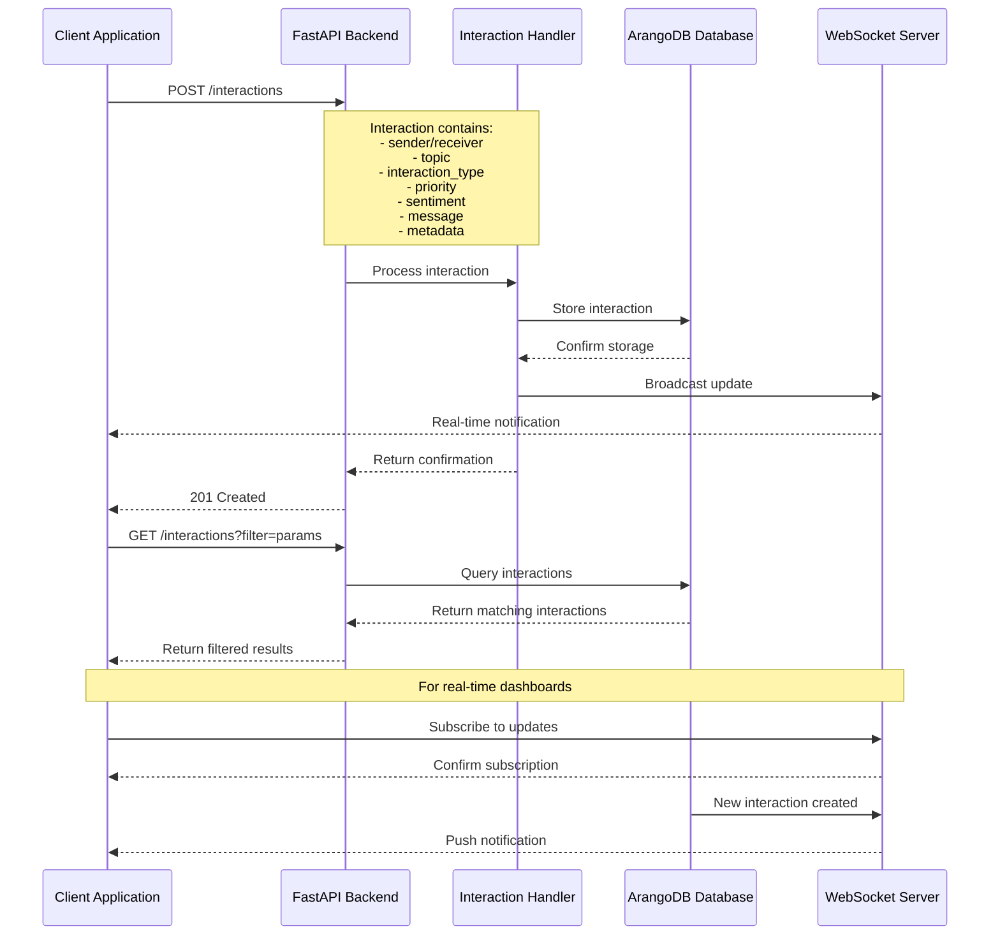
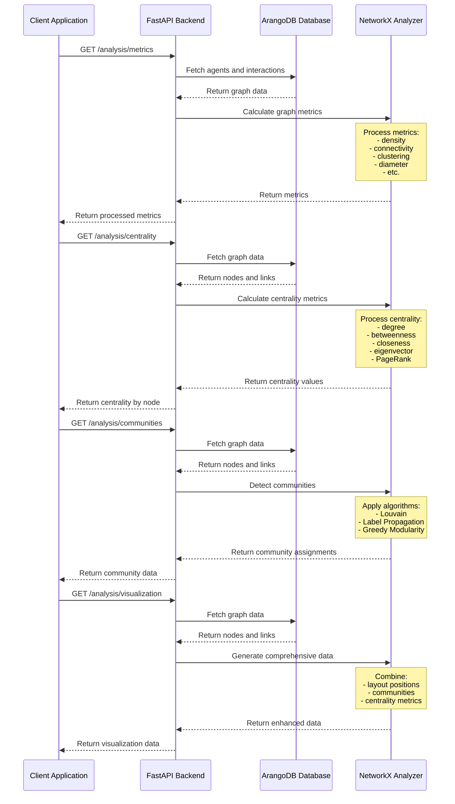

# Agent Interaction Backend v0.8.2

A Multi-Agent Graph Intelligence System for processing, storing, and analyzing agent interactions with advanced network analysis capabilities.

## 🌟 New in v0.8.2: NetworkX Integration

This release introduces comprehensive graph analysis through NetworkX integration:

- **Advanced Graph Metrics**: Density, diameter, clustering coefficient, connectivity
- **Node Centrality Analysis**: Identify key agents through degree, betweenness, closeness, eigenvector centrality, and PageRank
- **Community Detection**: Discover agent clusters using Louvain, Label Propagation, and other algorithms
- **Temporal Network Analysis**: Track how interaction patterns evolve over time
- **Custom Force-Directed Layouts**: Generate optimal node positions for visualizations
- **Enhanced API Endpoints**: `/analysis/*` endpoints for all network analysis features

## Core Features

- FastAPI-based REST API with WebSocket support for real-time updates
- ArangoDB graph database for persistent storage of agent interactions
- Enhanced Agent Interaction model with rich metadata
- Consistent REST API endpoints for interactions, agents, and data generation
- Multiple scenario-based synthetic data generators:
  - Predator/Prey (information propagation)
  - Prisoner's Dilemma (cooperation dynamics)
  - Pursuer/Evader (spatial dynamics)
  - Search and Rescue (coordination patterns)
- Interactive API documentation with Swagger UI
- Real-time agent interaction monitoring via WebSocket
- Comprehensive test suite with 75+ tests and >50% code coverage
- Extensive logging and monitoring with Prometheus/Grafana integration
- Docker containers with flexible deployment options:
  - Production mode with full monitoring stack
  - Development mode with minimal components
  - Automated testing environment with containerized tests

## System Architecture



## Domain Model



## Data Flow and Analytics Processes

### Core Interaction Flow



### Network Analysis Flow



## API Endpoints

### Core Endpoints

- `/agents` - Create and query agents
- `/agents/{agent_id}/interactions` - Get agent interactions
- `/agents/{agent_id}/runs` - Get agent runs
- `/interactions` - Create and query interactions
- `/graph` - Get graph visualization data
- `/network` - Get network data
- `/network/query` - Query network with filters
- `/query` - Natural language query interface

### Data Generation Endpoints

- `/generate/data` - Generate basic synthetic data
- `/generate/scenario` - Generate scenario-based data:
  - `scenario=predator_prey` - Information propagation simulation
  - `scenario=pd` - Prisoner's Dilemma cooperation dynamics
  - `scenario=pursuer_evader` - Spatial pursuit-evasion dynamics
  - `scenario=search_rescue` - Team coordination scenario

### Network Analysis Endpoints (New in v0.8.2)

- `/analysis/metrics` - Get comprehensive graph metrics
  - Node/edge counts, density, connectivity components
  - Clustering coefficient, diameter, path lengths
  
- `/analysis/centrality` - Calculate node importance measures
  - Degree centrality (in/out for directed graphs)
  - Betweenness centrality (bridge nodes)
  - Closeness centrality (proximity)
  - Eigenvector centrality (connected to important nodes)
  - PageRank (for directed graphs)
  
- `/analysis/communities` - Detect natural clusters
  - Multiple algorithms: Louvain, Label Propagation, etc.
  - Community sizes and modularity metrics
  
- `/analysis/layout` - Generate layout positions for visualization
  - Various algorithms: Spring, Circular, Spectral, etc.
  - 2D or 3D coordinate generation
  
- `/analysis/temporal` - Analyze network evolution over time
  - Time windowed metrics calculations
  - Temporal patterns detection
  
- `/analysis/visualization` - Get enhanced graph visualization data
  - Combined layout, communities, and metrics
  - Optimized for visualization libraries

Access the full interactive API documentation at [`http://localhost:8000/docs`](http://localhost:8000/docs) when the server is running.

## Prerequisites

- Python 3.11+
- ArangoDB 3.11+
- Docker and Docker Compose
- Node.js 18+ (for frontend development)

## Installation

1. Clone the repository:
```bash
git clone https://github.com/JtPerez-Acle/agent-interaction-backend
cd agent-interaction-backend
```

2. Choose one of the following startup methods:

### Initial Setup (First-time Users)
```bash
./setup.sh
```
This interactive script guides you through the first-time setup with:
- Customizable ArangoDB password configuration
- Complete services startup with a clean environment
- Database connectivity verification and troubleshooting
- Summary of available commands

### Production Deployment
```bash
./start.sh
```
Starts the full stack with:
- ArangoDB database
- Backend FastAPI service
- Prometheus and Grafana for monitoring
- Perfect for production or demonstration

### Development Environment
```bash
./start_dev.sh
```
Starts a lightweight environment with:
- ArangoDB database
- Backend FastAPI service
- Optimized for development without monitoring overhead

### Shutdown
```bash
./stop.sh
```
Gracefully stops all running services.

### Manual Local Development
```bash
# Start ArangoDB with Docker
docker-compose up -d arangodb

# Backend development setup
python -m venv venv
source venv/bin/activate  # On Windows: venv\Scripts\activate
poetry install

# Run backend server
poetry run uvicorn app.main:app --reload

# Frontend development setup
cd ../kqml-parser-frontend
npm install
npm run dev
```

## Environment Variables

The application uses these environment variables:

### ArangoDB Settings
- `ARANGO_HOST`: ArangoDB host (default: `localhost`)
- `ARANGO_PORT`: ArangoDB port (default: `8529`)
- `ARANGO_DB`: ArangoDB database name (default: `agent_interactions`)
- `ARANGO_USER`: ArangoDB username (default: `root`)
- `ARANGO_PASSWORD`: ArangoDB password (default: `password`)

These are set in the `docker-compose.yml` file. For local development:
```bash
export ARANGO_HOST=localhost
export ARANGO_PORT=8529
export ARANGO_DB=agent_interactions
export ARANGO_USER=root
export ARANGO_PASSWORD=password
```

> **Note About ArangoDB**: 
> ArangoDB is a multi-model database that supports document, graph, and key-value storage, making it perfect for our agent interaction system. The web interface (accessible at http://localhost:8529 after starting the containers) provides intuitive tools for visualizing and managing your data.
>
> Use the provided `setup.sh` script for an automated, guided setup experience.

## Running Tests

### Using run_tests.sh (Recommended)

We provide a script that handles the test setup and execution:

```bash
./run_tests.sh
```

This script will:
1. Clean up any existing test containers and volumes
2. Build a fresh test environment using Docker Compose
3. Start an ArangoDB container for testing
4. Run the test suite with coverage reporting
5. Clean up all test containers and volumes after completion

### Manual Testing

For more control over the test environment:

1. Start the test ArangoDB container:
```bash
docker-compose -f docker-compose.test.yml up -d arangodb
```

2. Run the tests:
```bash
pytest -v --cov=app --cov-report=term-missing
```

## Running the Application

### Using Start Scripts (Recommended)

We provide several scripts to manage the application:

1. **Production Mode:**
```bash
./start.sh
```
This script will start the complete stack including:
- ArangoDB database
- Backend API service
- Prometheus for metrics
- Grafana for dashboards
- Log aggregator

2. **Development Mode:**
```bash
./start_dev.sh
```
This starts a minimal environment with:
- ArangoDB database
- Backend API service
Perfect for development when you don't need the full monitoring stack.

3. **Stop Services:**
```bash
./stop.sh
```
This gracefully stops all running services.

### Manual Startup

For local development without Docker:
```bash
# Activate your virtual environment
source venv/bin/activate  # On Windows: venv\Scripts\activate

# Start the FastAPI server
uvicorn app.main:app --reload
```

The API will be available at:
- API: http://localhost:8000
- Interactive Documentation (Swagger UI): http://localhost:8000/docs
- Alternative Documentation (ReDoc): http://localhost:8000/redoc
- WebSocket: ws://localhost:8000/ws

The Frontend will be available at:
- http://localhost:3000 (when running the frontend separately)

## API Endpoints

### Root Endpoint
- `GET /` - Get API information

### Interaction Management
- `POST /interactions` - Create a new interaction
- `GET /interactions` - Get all interactions with optional filtering
- `GET /interactions/{interaction_id}` - Get a specific interaction

### Agent Management
- `POST /agents` - Create a new agent
- `GET /agents` - Get all agents
- `POST /agents/interaction` - Store an agent interaction
- `GET /agents/{agent_id}/interactions` - Get all interactions for a specific agent
- `GET /agents/{agent_id}/runs` - Get all runs for a specific agent
- `GET /agents/stats` - Get agent statistics

### Network Operations
- `GET /network` - Get network graph data with optional filtering
- `POST /network/query` - Query network graph with specific filters

### Graph Visualization
- `GET /graph` - Get nodes and links for graph visualization

### Network Analysis
- `GET /analysis/metrics` - Get comprehensive graph metrics (density, clustering, etc.)
- `GET /analysis/centrality` - Get node centrality measures (degree, betweenness, etc.)
- `GET /analysis/communities` - Detect communities within the network
- `GET /analysis/layout` - Generate layout coordinates for graph visualization
- `GET /analysis/temporal` - Analyze graph metrics over time periods
- `GET /analysis/visualization` - Get comprehensive visualization data with metrics

### Query Operations
- `POST /query` - Execute natural language queries on interactions

### Data Generation
- `POST /generate/data` - Generate synthetic agent and interaction data
- `POST /generate/kqml` - Generate a synthetic KQML interaction
- `GET /generate/interaction` - Generate a single random interaction without storing it

### Database Operations
- `DELETE /admin/database/clear` - Clear all data from the database
- `POST /admin/database/clean` - Clean up orphaned nodes and invalid relationships

### Deprecated Endpoints (for backward compatibility)
- `POST /agents/message` - Store an interaction (use `/agents/interaction` instead)
- `POST /synthetic/data` - Generate synthetic data (use `/generate/data` instead)
- `POST /synthetic/kqml` - Generate synthetic interactions (use `/generate/kqml` instead)

### WebSocket
- `WebSocket /ws` - Real-time interaction updates

For detailed API documentation with request/response examples, please refer to the [API_ENDPOINTS.md](./API_ENDPOINTS.md) file or visit the Swagger UI at http://localhost:8000/docs when the backend is running.

## Docker Deployment

The full stack can be deployed using Docker Compose:


## Database Schema

### ArangoDB Implementation

The system now uses ArangoDB, a multi-model database that provides excellent graph capabilities while being easier to manage than Neo4j:


## Monitoring Dashboard


## Contributing

1. Fork the repository
2. Create a feature branch
3. Make your changes
4. Run tests to ensure they pass
5. Submit a pull request

## License

MIT License. See LICENSE file for details.